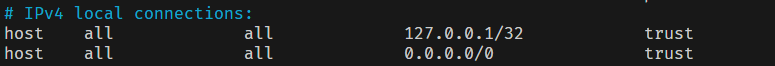

# Install Docker on Debian

#### 1. Set up Docker's apt repository

```
# Add Docker's official GPG key:
sudo apt-get update
sudo apt-get install ca-certificates curl
sudo install -m 0755 -d /etc/apt/keyrings
sudo curl -fsSL https://download.docker.com/linux/debian/gpg -o /etc/apt/keyrings/docker.asc
sudo chmod a+r /etc/apt/keyrings/docker.asc

# Add the repository to Apt sources:
echo \
  "deb [arch=$(dpkg --print-architecture) signed-by=/etc/apt/keyrings/docker.asc] https://download.docker.com/linux/debian \
  $(. /etc/os-release && echo "$VERSION_CODENAME") stable" | \
  sudo tee /etc/apt/sources.list.d/docker.list > /dev/null
sudo apt-get update
```

#### 2. Install the Docker packages

```
sudo apt-get install docker-ce docker-ce-cli containerd.io docker-buildx-plugin docker-compose-plugin
```

# Deploy Postgres on Debian Server

## Install Postgres

### Update the package lists and fix bug:

> sudo apt-get update \
> sudo apt-get install gnupg #if error gnupg

### Create the file repository configuration:

> sudo sh -c 'echo "deb https://apt.postgresql.org/pub/repos/apt $(lsb_release -cs)-pgdg main" > /etc/apt/sources.list.d/pgdg.list'

### Import the repository signing key:

> wget --quiet -O - https://www.postgresql.org/media/keys/ACCC4CF8.asc | sudo apt-key add -

### Update and install package:

> sudo apt-get update \
> sudo apt install postgresql-16

### Enable service Postgres

> sudo systemctl start postgresql.service \
> sudo systemctl enable postgresql.service

### Configure default user password Postgres

> sudo su postgres\
> psql\
> \password

#### Enter password : dev@123

## Install Postgres PgAdmin4

### Install packages

> curl -fsS https://www.pgadmin.org/static/packages_pgadmin_org.pub | sudo gpg --dearmor -o /usr/share/keyrings/packages-pgadmin-org.gpg
>
> sudo sh -c 'echo "deb [signed-by=/usr/share/keyrings/packages-pgadmin-org.gpg] https://ftp.postgresql.org/pub/pgadmin/pgadmin4/apt/$(lsb_release -cs) pgadmin4 main" > /etc/apt/sources.list.d/pgadmin4.list && apt update'
>
> sudo apt install pgadmin4

### Configure infomations login

> sudo /usr/pgadmin4/bin/setup-web.sh

#### Enter email admin : devadmin@dev123.email

#### Enter password : dev@123

### Configure accpect connection to server

> sudo nano /etc/postgresql/16/main/postgresql.conf


> sudo nano /etc/postgresql/16/main/pg_hba.conf



# Deploy Nginx on Debian Server

## Update packages and install Nginx:

> sudo apt update \
> sudo apt install nginx

## Start Nginx and enable when server up:

> sudo systemctl start nginx \
> sudo systemctl enable nginx \
> #Check ngnix \
> sudo systemctl status nginx

## Note:

#### File configure: `/etc/nginx/nginx.conf`

#### Shell:

> sudo systemctl restart nginx
>
> sudo systemctl reload nginx

## Configure API Getway and Load Balance

### Switch to root mode

> sudo su

### Remove include site-enabled

> nano /etc/nginx/nginx.conf


### Configure file

> cd /etc/nginx/conf.d \
> nano api-getway.conf

```
upstream service1 {
    server 0.0.0.0:80;
}
upstream service2 {
    server 0.0.0.0:80;
}
upstream service3 {
    server 0.0.0.0:80;
}

server {

    listen 80;
    server_name nginx.dev;

    location / {
        root /usr/share/nginx/html;
        index index.html index.htm;
    }

    error_page 500 502 503 504 /50x.html;

    location = /50x.html {
        root /usr/share/nginx/html;
    }

    location /service/ {
        proxy_pass http://service1/;
    }

    location /config/ {
        proxy_pass http://service2/;
    }

    location /defaut/ {
        proxy_pass http://service3/;
    }

}
```
