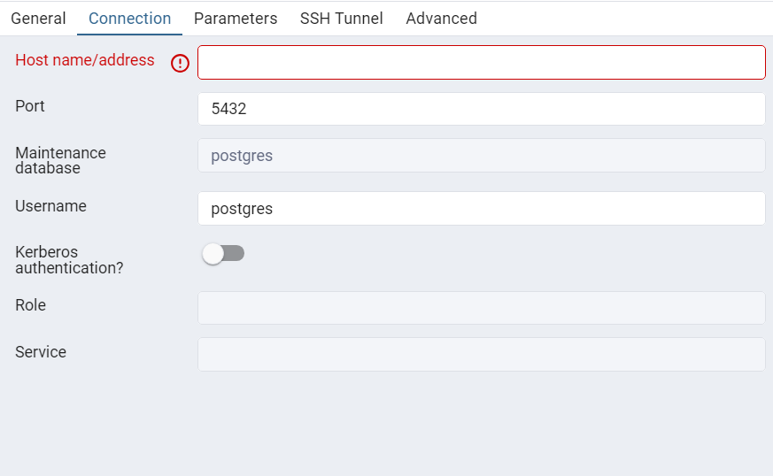

# Document Server

### General information

| Server   | Type                     | Address IP    | Port | Host Name | Domain |
| -------- | ------------------------ | ------------- | ---- | --------- | ------ |
| Postgres | Database                 | 50.18.86.128  | 5432 | -         | -      |
| Postgres | PgAdmin4 Dashboard       | 50.18.86.128  | 80   | -         | -      |
| Nginx    | API Gateway/Load Balance | 54.241.138.26 | 80   | -         | -      |

### Connect to the database

#### Method 1: Use PgAdmin4 on your computer or software with database connection feature

Register Server with information Database Server\
Note: Enter Host name/Address like Address IP [Database](#general-information)

#### Method 2: Use PgAdmin4 Dashboard on website

Access URL: http://[PgAdmin4 Address IP](#general-information)/pgadmin4/browser/

Login with information:

> Email: devadmin@dev123.email \
> Password: dev@123

Register Server with information Database Server\
Note: Enter Host name/Address like Address IP [Database](#general-information)

